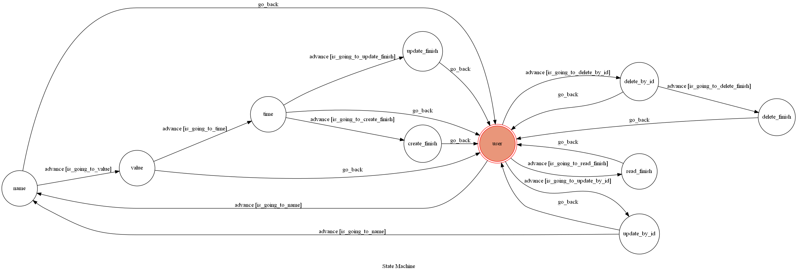

# 記帳超人-記帳型Line Bot

A Line bot based on a finite state machine.

## 說明
這是記帳超人，一個輔助使用者紀錄日常消費的Line Bot。
使用者可以透過下達簡單的指令來要求機器人做出要求的行為。
這些行為包括: 記帳、印出帳單、刪除記帳、修改記帳以及傳送這個bot的fsm圖

## 環境
* anaconda
* python 3.6.7

## Finite State Machine

## 使用方式
一開始進入聊天時，機器人會處於 'user' state。

這個狀態可以輸入的指令有:
* create: 創建記帳，會依序進入 'name'、'value'、'time' state並輸入名稱、金額以及日期，結束後返回 'user' state。

* read:   印出帳單，依id順序印出之前紀錄的帳單資訊，如果沒有紀錄就會回傳 "無記帳紀錄"，結束後返回 'user' state。

* delete: 刪除記帳，會進入 'delete_by_id' state，輸入id後如果有找到結果就刪除後返回 'user' state。

* update: 修改記帳，會進入 'update_by_id' state，
          輸入id後如果有找到結果會依序進入 'name'、'value'、'time' state並修改名稱、金額以及日期，結束後返回 'user' state。

除此之外，在任意狀態皆可使用的指令有:
* !restart: 返回 'user' state，記錄到一半的名稱、金額或日期會被放棄。

* fsm: 讓bot回傳fsm的png檔。
